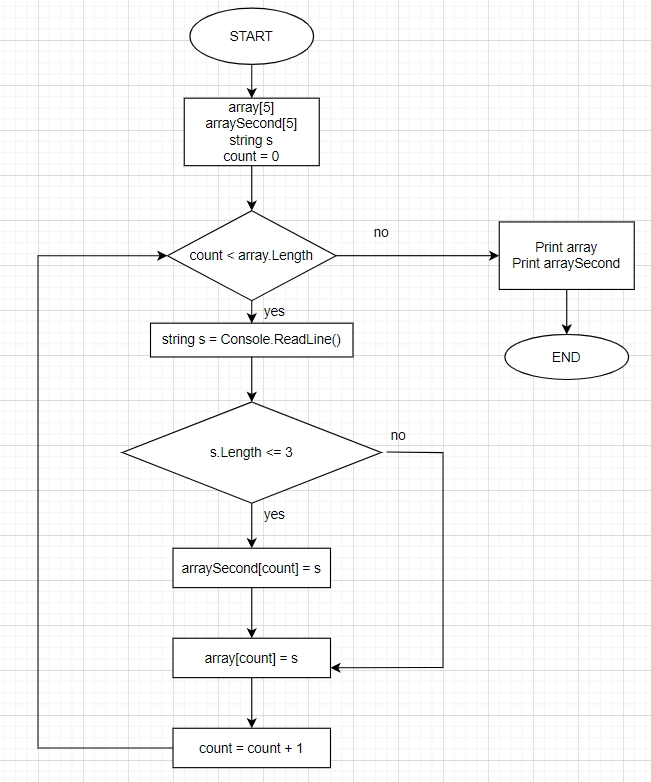

## Control_work

Вашему вниманию предлагается решение предложенной задачи в виде блок-схемы:

## Описание решения

Предлагается использовать два одномерных строковых массива, каждый из которых содержит 5 элементов: **array[]** и **arraySecond[]**. Создадим строковую переменную **s** для введения элементов в массивы и дальнейшей сортировки по длине строки. Создадим счетчик **count** и обнулим его.

До тех пор пока счетчик не примет значение больше или равное длине array[], выполняется цикл: *переменная s вводится с клавиатуры, затем количество символов в ней сравнивается с предложенным по условию задачи числом 3, в случае выполнения условия значение переменной s становится элементом массивов arraySecond[] и array[]; в случае невыполнения условия значение переменной s становится элементом только массива array[] (таким образом осуществляется сортировка всех предложенных 5 элементов для массивов); после проверки на условие счетчик count увеличивается на 1.* Как только счетчик принимает значение равное 5, программа выводит на экран элементы двух массивов: array[] - до сортировки, arraySecond[] - после сортировки согласно условию задачи.